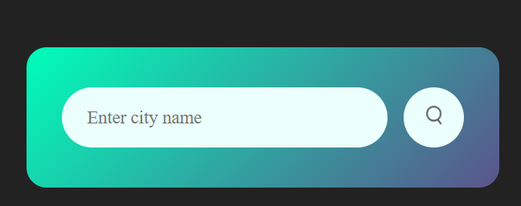
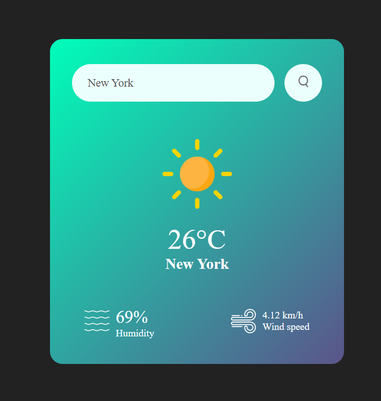
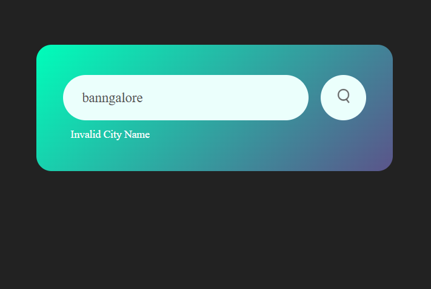

# Weather App

This is a simple weather application built using HTML, CSS, and JavaScript that fetches real-time weather data from the OpenWeatherMap API. Users can search for the current weather conditions of any city.

## Features

- Real-time weather information for any city.
- Displays temperature, humidity, wind speed, and weather conditions.
- Provides visual weather icons for different weather conditions.
- Handles invalid city names and displays an error message.

## Screenshots

### Home Screen

### Weather Information

### Invalid City Error

## Code Overview

### `index.html`

This file contains the HTML structure of the app, including the search box, error message container, and weather information display.

### `style.css`

This file contains the CSS styles for the app, ensuring a responsive and visually appealing layout.

### `script.js`

This file contains the JavaScript code to fetch and display the weather data from the OpenWeatherMap API. It handles user interactions, API requests, and updates the DOM based on the weather information or errors.

